# Cross-System Analysis Tool

A comprehensive performance analysis tool for comparing results from different runs of [perfscripts](https://github.com/jshook/perfscripts). Automatically discovers FIO test results, groups systems by common characteristics, and generates detailed performance reports with knee-point analysis and **🎯 intelligent multi-dimensional scoring** for advanced system rankings.

## Key Features

- **Automatic System Discovery**: Intelligently groups test results by system profiles
- **🎯 Multi-Dimensional Scoring**: Customizable scoring functions balancing throughput, latency, and consistency
- **📊 JSON Metrics Export**: Structured performance data for programmatic analysis and value functions
- **Comprehensive Analysis**: Determines optimal blocksizes and performance thresholds
- **Knee-Point Detection**: Identifies performance degradation points under mixed workloads  
- **Visual Performance Indicators**: Unicode sparklines show latency progression patterns
- **🚫 Smart Exclusions**: `.noscan` files to exclude directories from analysis
- **Multi-Level Reporting**: Individual systems, profile summaries, and cross-profile comparisons
- **Standardized Output**: JSON and Markdown reports for both human and machine consumption

## Quick Start

### Prerequisites

- Java 11 or higher
- Maven 3.6 or higher
- FIO test results in JSON format

### Installation

1. Clone or download this repository
2. Ensure Java and Maven are installed
3. Make the analyze script executable: `chmod +x analyze`

### Basic Usage

```bash
# Run analysis with default settings
./analyze

# Custom report directory
./analyze --report-dir my-performance-analysis

# 🎯 Use specific ranking functions
./analyze --ranking-functions realtime,throughput-oriented

# Update existing report  
./analyze --report-dir existing-report -U

# Show help
./analyze --help
```

### Example Directory Structure

```
your-project/
├── bare-metal/
│   ├── server1/
│   │   └── logs/
│   │       ├── randread-001-1k.fio.json
│   │       ├── randread-005-16k.fio.json
│   │       └── mixed-301-1to4k_10Mseq.fio.json
│   └── server2/
│       └── logs/ ...
├── virtualized/
│   ├── vm1/ ...
│   └── vm2/ ...
└── analyze*
```

## Analysis Method

The tool implements a systematic 4-stage analysis process:

### Stage 1: System Enumeration
- Discovers directories containing `*.fio.json` files
- Groups systems by common path prefixes into "profiles"
- Derives clean system names by removing common path elements
- Generates JSON and Markdown manifests

### Stage 2: Individual System Analysis
For each system:
1. **Optimal Blocksize Detection**: Analyzes random read workloads to find highest throughput blocksize
2. **Mixed Workload Matching**: Selects mixed workload series with closest average blocksize
3. **Knee-Point Analysis**: Identifies performance thresholds where latency increases >20%
4. **Sparkline Generation**: Creates visual latency progression indicators

### Stage 3: System Profile Summaries
- Aggregates individual system results within each profile
- Calculates profile-wide statistics and rankings
- Identifies best and worst performers per profile

### Stage 4: Cross-Profile Comparisons  
- Compares key performance indicators across profiles
- **🎯 Generates intelligent scored rankings** using customizable scoring functions
- Provides both scored and traditional throughput-based rankings
- Provides strategic insights for system selection

## Workload Types Supported

| Pattern | Example | Description |
|---------|---------|-------------|
| `randread-###-<size>.fio.json` | `randread-005-16k.fio.json` | Random read with specific blocksize |
| `seqread-###-<size>.fio.json` | `seqread-100-32g.fio.json` | Sequential read with file size |  
| `seqwrite-###-<size>.fio.json` | `seqwrite-200-32g.fio.json` | Sequential write with file size |
| `mixed-###-<range>_<limit>.fio.json` | `mixed-301-1to4k_10Mseq.fio.json` | Mixed I/O with blocksize range and streaming limit |

## Report Structure

```
report/
├── manifest.md                        # Human-readable discovery results
├── manifest.json                      # Machine-readable manifest
├── {profile}__{system}.md             # Individual system analysis
├── 📊 {profile}__{system}.json        # System performance metrics (JSON)
├── PROFILE_{profile}.md               # Profile summary reports
├── 📊 PROFILE_{profile}.json          # Profile performance metrics (JSON)
└── CROSS_PROFILE_COMPARISON.md        # Cross-profile comparisons with scoring
```

## Key Performance Insights

### What the Tool Measures
- **Optimal Blocksize**: Best random read performance configuration (for matching mixed workloads)
- **Mixed Workload Components**: Random read, sequential read, and sequential write performance from optimal mixed workloads
- **Knee Points**: Performance thresholds where latency increases dramatically
- **Latency Progressions**: How performance degrades with increased streaming load
- **System Rankings**: Comparative performance using optimal mixed workload metrics

### 🎯 Advanced Multi-Ranking System (NEW!)
- **Multiple Ranking Functions**: Compare systems across different performance priorities simultaneously
- **Pre-Built Functions**: `realtime`, `throughput-oriented`, `balanced`, `consistency-oriented`
- **Customizable Weights**: Configure importance of different performance aspects
- **Threshold Penalties**: Massive score reduction for "no-go" conditions
- **Value Function Ready**: JSON metrics for automated decision making

### Built-in Ranking Functions
All ranking functions use metrics from optimal mixed workload components:
- **realtime**: 60% P99 latency, 40% throughput (ultra-low latency focus)
- **throughput-oriented**: 80% throughput, 15% IOPS, 5% latency (high-throughput focus)  
- **balanced**: 33.3% throughput, 33.3% latency, 33.3% consistency (even performance balance)
- **consistency-oriented**: 40% consistency, 35% P95 latency, 25% throughput (stable performance focus)

### Visual Indicators
- **Unicode Sparklines**: `▁▂▃▄▅▆▇█` show latency progression on logarithmic scale
- **Performance Classes**: High/Medium/Low classifications for quick assessment
- **Quantile Panels**: P50/P95/P99 latency comparisons in grid format
- **📊 Scored Rankings**: Multi-dimensional system rankings with explanations

## Documentation

- **[User Guide](docs/user-guide.md)**: Complete usage instructions and advanced features
- **[Interpreting Results](docs/interpreting-results.md)**: How to read and analyze the generated reports
- **[Ranking Functions Guide](docs/ranking-functions.md)**: 🎯 How to use and create custom ranking functions
- **[Analysis Method](analysis_method.md)**: Detailed methodology and requirements

## Command Line Reference

```
Usage: ./analyze [OPTIONS]

Options:
  --report-dir DIR        Specify report directory name (default: "report")
  --ranking-functions NAME 🎯 Name(s) of ranking function(s) from ranking-functions.json
                          Supports comma-separated values and multiple occurrences
  -U                      Update mode - allow overwriting existing report  
  -h, --help              Show help message

Examples:
  ./analyze                                    # All ranking functions (realtime, throughput-oriented, balanced, consistency-oriented)
  ./analyze --report-dir perf-2024-01          # Custom directory with all rankings
  ./analyze --ranking-functions realtime       # 🎯 Only real-time optimized ranking
  ./analyze --ranking-functions realtime,balanced  # 🎯 Multiple specific rankings
  ./analyze --report-dir existing -U           # Update existing
```

## System Requirements

- **Java**: OpenJDK 11 or higher
- **Maven**: 3.6 or higher  
- **Memory**: 512MB RAM minimum (scales with number of systems)
- **Storage**: ~10MB per 1000 workload files for reports

## Architecture

```mermaid
graph TB
    subgraph "Input Layer"
        A[FIO JSON Files]
        B[.noscan Exclusions]
        C[ranking-functions.json]
    end
    
    subgraph "Analysis Engine"
        D[ReportAnalyzer]
        E[WorkloadAnalyzer]
        F[ScoringFunction]
        G[SparklineGenerator]
    end
    
    subgraph "Data Models"
        H[SystemMetrics]
        I[FioResult]
        J[SystemPerformanceData]
    end
    
    subgraph "Output Layer"
        K[📄 Markdown Reports]
        L[📊 JSON Metrics]
        M[🎯 Multi-Dimensional Rankings]
        N[📈 Unicode Sparklines]
    end
    
    A --> D
    B --> D
    C --> F
    D --> E
    D --> F
    D --> G
    
    E --> H
    E --> I
    F --> J
    
    H --> K
    H --> L
    F --> M
    G --> N
    
    style D fill:#e3f2fd
    style F fill:#fff3e0
    style H fill:#e8f5e8
    style M fill:#fce4ec
```



**Technical Details:**
- **Language**: Java 17 compatible
- **Build System**: Maven
- **Dependencies**: Jackson (JSON processing), JUnit 5 (testing), minimal external dependencies
- **Output Formats**: Markdown, JSON
- **🎯 Scoring System**: Well-encapsulated with comprehensive unit tests (11 test scenarios)
- **Execution**: Command-line tool with shell wrapper

## Contributing

This tool follows a specification-driven development approach. See `analysis_method.md` for the complete requirements specification.

## License

Licensed under the Apache License, Version 2.0. See [LICENSE](LICENSE) for details.

## Related Projects

- **[perfscripts](https://github.com/jshook/perfscripts)**: Performance testing scripts that generate the FIO results this tool analyzes
- **FIO**: The Flexible I/O tester used to generate the underlying performance data