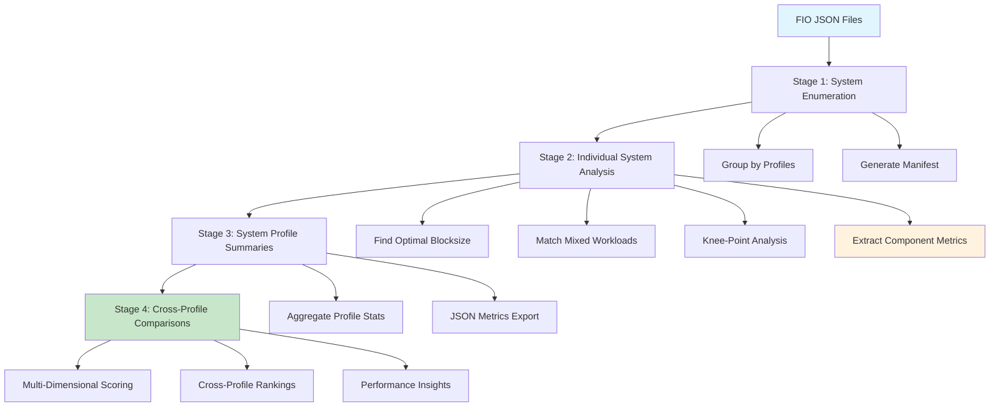
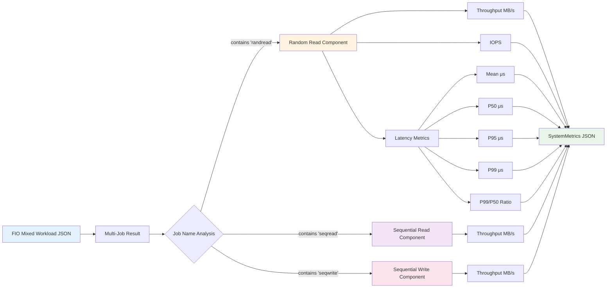

# Cross-System Analysis

This document describes the method used to compare the results of different runs of github.com/jshook/perfscripts.

Agents should *NOT* modify this file.

## Analysis Overview

## Usage

Regardless of the implementation stack or language, the command to run a report should be simply './analyze'

## Terms

The individual "*.fio.json" files are known as _workloads_. Workload files may have multiple results within them known as _components_.

## Conventions

When systems or profiles are listed in any report, the order of presentation needs to be explained, even if it is not ordered.

## Organization

At the top of reports, a TOC should be presented, with links to interior sections.

## Stage 0, Prepare Report target

If there is already a subdirectory matching the glob 'report_*', then use it. Otherwise create one with the name "report". The report directory should be an optional option "--report-dir", and if it already exists, then the '-U' option for "update" must be provided to avoid accidentally overwriting a previous report, but only if it isn't the default "report" name.

## Stage 1, Enumerate Results

In order to facilitate proper grouping and labeling of results, the following directory structure is used:
1. Directories which contain any "*.fio.json" files are included. Each directory included this way is known as a "system path", and should be retained as such.
2. All system paths are grouped according to common leading path components.
3. For each group of paths which has common leading components, a "system profile" is created. System profiles have system paths. and System profile names.
   1. The system profile name is created from the common leading path components for all the systems included, with basic sanitization of the name to avoid path seperator characters.
   2. The system profile path is simply the path which is the common prefix among all system paths.
4. Each system path is used to derive an associated system name:
   1. Each system path is relativized with respect to the associated system profile path.
   2. The name of the system is then taken as the relativized system path, but with the common leading and trailing path components removed, among all systems within the system profile.
   3. The system name is also sanitized.
   4. The system name and the system path are kept separately.
5. Thus we have:
   1. Each system profile, consisting of
      a. a system profile name
      b. a system profile path
      c. a set of associated systems, each consisting of
         1. a system path
         2. a system name
6. It should be easy to find the "*.fio.json" files for a given system by simply resolving the system path within the system profile path. Within the resolved directory path, the "*.fio.json" files should be visibile.
8. A manifest.json file is created in the report directory with all these details in hierarchical structure.
9. A manifest.md file is created in the report directory with the same details, but with a human-friendly layout.
10. A special exception is provided for explicitly excluding directories from analysis. Simply add a `.noscan` file to any directories which should not be traversed.

## Stage 2, Single Directory Analysis

Each included system with a system profile gets analyzed separately.

### Single Directory Structure

The "*.fio.json" files within a directory contain a set of fio test results in the canonical fio json output format.
These files are named specifically to identify the access patterns, and are organized by an identifier and associated series name.
Here are the naming details for each type of workload:
* `randread-000-512.fio.json` is a "random read" workload with a test id of "000" (series 000), with a request size of 512 bytes.
* `randread-007-64k.fio.json` is a "random read" workload, with a test id of "007" (series 000), with a request size of 64k bytes.
* `seqread-100-32g.fio.json` is a "sequential read" workload, with test id "100" (series 100), with a 32GB file size.
* `seqwrite-200-32g.fio.json` is a "sequential write" workload, with a test id of "200" (series 200), with a 32GB file size.
* `mixed-301-1to4k_10Mseq.fio.json` is a "mixed" workload, containing multiple components: sequential reads, sequential writes, and random io. It has an id of "301" (series 300), and a request size ranging between 1k and 4k bytes, where the sequential reads and writes are limited to 10MB/s. These files combine the workload components of the earlier series, thus have multiple component results per file.

When interpreting the block size indicators in randread file names, the format may be one of `<min><suffix>to<max><suffix>` or `<min>to<max>suffix`. In the latter case, the suffix applies to both numbers.

### Report Processing

For stage 2 report generation, a separate report is created in the report directory for each system in each system profile. The name should include the system profile name and the system name, concatenated with a double underscore.

Key metrics for randread workloads are throughput, latency, and ops/s.
Key metrics for seqread and seqwrite workloads are throughput.
Key metrics for mixed workloads include througput, latency, and ops/s of the randread portion, throughput of the sequential portions.

Each system's analysis should proceed with these specific steps:
1. Determine optimal blocksize: The randread results are analyzed to determine which blocksize achieves the highest throughput for that system.
2. Determine matching mixed workload: According to the optimal randread workload, a mixed workload series is selected with the closest average blocksize.
3. Knee-point analysis of mixed workloads: The selected mixed workload series is analyzed, comparing the knee points for each of the completion latencies, slewing across the stream throttling values. An unicode-based sparkline is created for each of the quantiles, showing order of magnitude changes from one streaming limit to the next.
4. The point at which the p99 latency increases more dramatically between two tests is the knee point. Of these two, the mixed workload with the lower latency is considered the "optimal mixed workload". The one with the higher latency is considered the "sub-optimal mixed workload". Both are reported with their key metrics.
   * The latency progression sparklines should represent, on a logorithmic scale, the amount of latency increase from one streaming limit to the next, going up from the lowest limit all the way up to unlimited.
   * There should be a panel of details for this shown between the two workloads, so that a view over the different quantiles is given.
   * A similarly layed-out view should show summary latencies on the same grid pattern below it.
5. From this point on, the metrics from the "optimal mixed workload" result should be considered the canonical and representative set of metrics for that system.
6. Further analysis should draw directly from the metrics related to this, and all other metrics should be left as detail only in the system-level report.
   * This includes all of the associated metrics for the winning workload, like the randread component throughput, ops/s, and latency.
   * It also has the streaming throughput for the read component and the write component.
   * All of these metrics are important, as long as the come from the winning mixed workload.
7. Any metrics used in ranking functions which are missing or zero should automatically disqualify such system and be annotated as such in reports.

* All of the data use, descriptions, calculations, and results should be shared in the report.
* The workload name needs to be added to each row 
* The key metrics for a given system need to be stored in a json file adjacent to the report name for that system. These metrics become available for value function scoring later.

Since the fio json output files may contain metrics with different suffix units, all time suffix units should be normalized to fractional milliseconds.

## Component Metrics Extraction Flow

### System Performance Profile

For stage 3 report generation, each system profile will have details summarized taking data from all of the system reports. This means, specifically from the optimal mixed workload findings for each system, and those metrics only.

Like system metrics, the system profile metrics should also be stored in a json file adjacent to the system profile report. These will become available for value function scoring later.

### Ranking Function Configuration

The ranking function consists of the product of several weighted components, and provides a scoring where higher values are better.

Each component of the ranking function is based on these facets:
* a specific metric available from previous stages, as stored in the related json file
* a mapping function to convert it into "positive inflective" form
* a scaling function to map the metric into a score
* optional threshold values.
* optional "no go" conditions.

These are to support these user-facing options:
* selecting latency quantiles and thresholds
* choosing how much throughput, op rate, or latency matters relative to each other
* Identifying conditions which are "no go" or which, when triggered, cause a massive reduction in value.
* Choosing roll-off or easing shapes for thresholds or conditions.

The ranking function logic should be implemented in a well-encapsulated way with very thorough unit tests and examples.
The available ranking functions should be defined in ranking-functions.json, to include:
* (first) a realtime system function which emphasizes good latency first, then throughput.
* a throughput-oriented ranking, which emphasizes throughput first, but also considered latency and, to a smaller degree, consistency
* a balanced ranking which includes throughput and latency and consistency evenly
* a consistency-oriented ranking which emphasizes the stability of results across systems
* an example ranking function like 'ranking-function-example' which uses all possible metrics and function options for the purpose of illustration.
While thresholds and penalty conditions should be available, they shouldn't be applied to any of the ranking functions described here.

Also, the ranking-functions.json should be an embedded resource, and if it doesn't exist also in the local directory before analysis commences, it should be copied out of the class path to the local directory.

For both the system level and the system profile level analysis, by default, all available ranking functions should be used.
For each ranking function used in any report, it should be contained in a separate sub-section with an appropriate title.
If the user specifies which ranking functions to use with the --ranking-functions option, then only those ranking functions should be used.

### Cross Profile Comparisons

For stage 4 report generation, each of the system profile summary reports will be used to create a comparative study.
It should include:
* key performance indicators for each system profile
* a ranking of systems according to their results
* a ranking of system profiles accoring to the system profile averages
* As with the system level analysis, the system profile analysis should use the same ranking functions and create a similar section in the cross-profile report.
  * for each of these ranked views, a line explaining the interpretation of the ranking function should be added.
* When no --ranking-function option is applied, then the report should also include a note telling the user how to select only a specific ranking function.

### Documentation

A basic userguid should be created in a docs directory that is kept up-to-date with the implementation
A guide for interpreting the results should also be added there.
A README.md file needs to be created to describe the project, it's key features, and a basic example on how to run it.
The APLv2 needs to be added to this directory.

