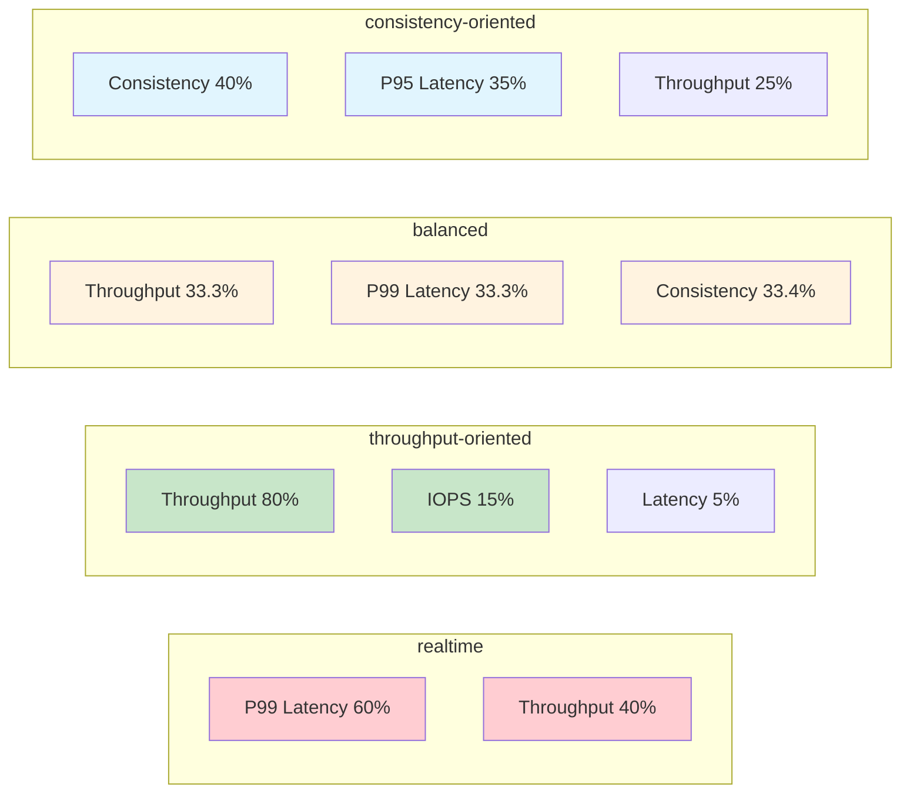

# Ranking Functions Guide

This guide explains how ranking functions work in the Cross-System Analysis tool and how to create custom ranking functions using the available performance metrics.

## Overview

Ranking functions provide a systematic way to score and compare system performance based on multiple metrics. Each ranking function applies weights, transformations, and thresholds to create a composite score where **higher values indicate better performance**.

## How Ranking Functions Work

### Scoring Process Flow

```mermaid
graph TD
    A[Raw Metric Value] --> B{Mapping Function}
    
    B -->|linear| C[Direct Value]
    B -->|log| D[log(1 + value)]
    B -->|inverse| E[1 / (1 + value)]
    B -->|threshold| F[Binary 0/1]
    
    C --> H{Threshold Check}
    D --> H
    E --> H
    F --> H
    
    H -->|Below Threshold| I[Apply Weight]
    H -->|Above Threshold| J[Apply Penalty × Weight]
    
    I --> K[Component Score]
    J --> K
    
    K --> L[Final Score = ∏(Component^Weight)]
    
    style A fill:#e3f2fd
    style H fill:#ffecb3
    style L fill:#e8f5e8
```

### Scoring Process Steps

The scoring system follows these steps for each metric component:

1. **Extract Raw Value**: Get the metric value from system analysis results
2. **Apply Mapping Function**: Transform the value using mathematical functions
3. **Apply Threshold Penalties**: Reduce scores when critical thresholds are exceeded
4. **Weight and Combine**: Apply component weights and combine into final score using product composition

### Final Score Calculation

The final score is calculated as:
```
Final Score = ∏(component_score^weight)
```

Where each component score is weighted by its importance in the overall ranking.

## Available Metrics

All performance metrics are extracted from the **optimal mixed workload** results after knee-point analysis. This ensures that metrics represent real-world mixed I/O performance rather than synthetic single-workload results.

### Random Read Component Metrics (from optimal mixed workload)
- `randread_throughput_mbps` - Random read throughput in MB/s (higher is better)
- `randread_iops` - Random read I/O operations per second (higher is better)
- `randread_latency_mean_ms` - Mean random read latency in milliseconds (lower is better)
- `randread_latency_p50_ms` - 50th percentile random read latency in milliseconds (lower is better)
- `randread_latency_p95_ms` - 95th percentile random read latency in milliseconds (lower is better)
- `randread_latency_p99_ms` - 99th percentile random read latency in milliseconds (lower is better)
- `randread_latency_p99_p50_ratio` - P99/P50 latency ratio indicating tail behavior (lower is better)

### Sequential Component Metrics (from optimal mixed workload)
- `seqread_throughput_mbps` - Sequential read throughput in MB/s (higher is better)
- `seqwrite_throughput_mbps` - Sequential write throughput in MB/s (higher is better)

### Analysis Metrics (from optimal mixed workload)
- `knee_point_latency_increase_percent` - Latency increase at knee point (lower is better)
- `optimal_stream_limit_mbps` - Stream throttling limit of optimal mixed workload (informational)

### System Information
- `total_workloads` - Number of workload files analyzed (informational)

### Legacy Metric Names (deprecated but supported)
For backward compatibility, the following legacy names map to randread component metrics:
- `optimal_throughput_mbps` → `randread_throughput_mbps`
- `optimal_iops` → `randread_iops`  
- `optimal_latency_mean_us` → `randread_latency_mean_ms`
- `optimal_latency_p50_us` → `randread_latency_p50_ms`
- `optimal_latency_p95_us` → `randread_latency_p95_ms`
- `optimal_latency_p99_us` → `randread_latency_p99_ms`
- `optimal_latency_p99_p50_ratio` → `randread_latency_p99_p50_ratio`

## Component Configuration

Each ranking function component supports these configuration options:

### Basic Properties
- `metric_name` (required): Name of the metric to use
- `weight` (required): Relative importance (0.0 to 1.0, weights should sum to 1.0)
- `invert_better` (required): Set to `true` for "lower is better" metrics (latency)

### Mapping Functions
Transform raw values before normalization:

- `linear`: No transformation (default)
- `log`: Logarithmic transformation - `log(1 + value)`
- `inverse`: Inverse transformation - `1 / (1 + value)`
- `threshold`: Binary transformation - returns 1.0 if value > 0, else 0.0

### Normalization Methods
**Note**: Normalization has been removed from the current implementation. Raw mapped values are used directly.

### Threshold Configuration
Apply penalties when performance conditions are not met:

- `threshold_value`: The threshold value to compare against
- `threshold_penalty`: Multiplication factor when threshold is triggered (0.0 to 1.0)
- `easing_function`: How the penalty is applied:
  - `linear`: Direct multiplication
  - `exponential`: Exponential decay
  - `sigmoid`: Smooth S-curve transition

## Pre-configured Ranking Functions



### realtime
**Focus**: Ultra-low latency systems
- 60% P99 latency weight
- 40% throughput weight
- Optimized for real-time applications requiring predictable response times

### throughput-oriented  
**Focus**: High-throughput data processing
- 80% throughput weight
- 15% IOPS weight
- 5% latency weight (with high threshold tolerance)

### balanced
**Focus**: Even performance across all dimensions
- 33.3% throughput weight
- 33.3% P99 latency weight
- 33.3% consistency weight

### consistency-oriented
**Focus**: Stable, predictable performance
- 40% consistency (knee point) weight
- 35% P95 latency weight
- 25% throughput weight

## Creating Custom Ranking Functions

### Example: Custom Gaming-Oriented Function

```json
{
  "gaming-optimized": {
    "description": "Gaming systems: 60% P95 latency, 25% consistency, 15% throughput (from mixed workload components)",
    "components": [
      {
        "metric_name": "randread_latency_p95_ms",
        "weight": 0.6,
        "mapping_function": "log",
        "threshold_value": 100.0,
        "threshold_penalty": 0.2,
        "easing_function": "exponential",
        "invert_better": true
      },
      {
        "metric_name": "knee_point_latency_increase_percent", 
        "weight": 0.25,
        "mapping_function": "inverse",
        "threshold_value": 20.0,
        "threshold_penalty": 0.4,
        "invert_better": true
      },
      {
        "metric_name": "randread_throughput_mbps",
        "weight": 0.15,
        "mapping_function": "log",
        "invert_better": false
      }
    ]
  }
}
```

### Best Practices

1. **Weight Distribution**: Ensure component weights sum to 1.0 for interpretable results
2. **Metric Selection**: Choose metrics that align with your performance priorities
3. **Threshold Values**: Set realistic thresholds based on your performance requirements
4. **Mapping Functions**: Use `log` for metrics with wide value ranges, `linear` for narrow ranges
5. **Testing**: Test your ranking function against known good/bad systems to validate behavior

### Common Patterns

**Latency-Critical Systems**:
- High weights on P95/P99 latency metrics
- Include P99/P50 ratio to capture tail latency behavior (values closer to 1.0 indicate consistent performance)
- Strict threshold penalties for latency spikes
- Use `log` or `inverse` mapping for latency metrics

**Throughput-Critical Systems**:
- High weights on throughput and IOPS metrics  
- Looser latency thresholds
- Use `log` mapping for throughput metrics with wide ranges

**Balanced Systems**:
- Even weight distribution across throughput, latency, and consistency
- Moderate threshold penalties
- Mixed mapping functions based on metric characteristics

## Using Custom Ranking Functions

1. **Add to ranking-functions.json**: Edit the configuration file in your working directory
2. **Specify via CLI**: Use `--ranking-functions your-function-name` 
3. **Validate**: Run analysis and review the scoring explanations in the reports

## Troubleshooting

**All scores are 0.0**: Check that metric names match exactly, including underscores and case
**Unexpected rankings**: Verify `invert_better` is set correctly for your metrics
**Extreme scores**: Consider using normalization and review threshold penalty values
**Missing metrics**: Ensure your systems have the required workload types for the metrics used

## Advanced Topics

### Multiple Function Analysis
Run analysis with multiple ranking functions to see different perspectives:
```bash
./analyze --ranking-functions realtime,throughput-oriented,balanced
```

### Latency Distribution Analysis

The **P99/P50 ratio** metric provides insights into latency tail behavior:
- **Ratio = 1.0**: Perfect consistency (P99 equals median)
- **Ratio = 2.0**: Moderate tail latency (P99 is 2x median)
- **Ratio > 5.0**: Significant tail latency issues (P99 much higher than typical)

This metric is particularly valuable for:
- **Real-time systems** requiring predictable latency
- **Interactive applications** where tail latency impacts user experience
- **Load balancing decisions** to identify systems with consistent performance

### Metric Combinations
Consider creating derived metrics by combining existing ones in your analysis pipeline before using them in ranking functions.

### Performance Profiles
Different ranking functions may be appropriate for different system profiles - consider the workload characteristics of your target systems.