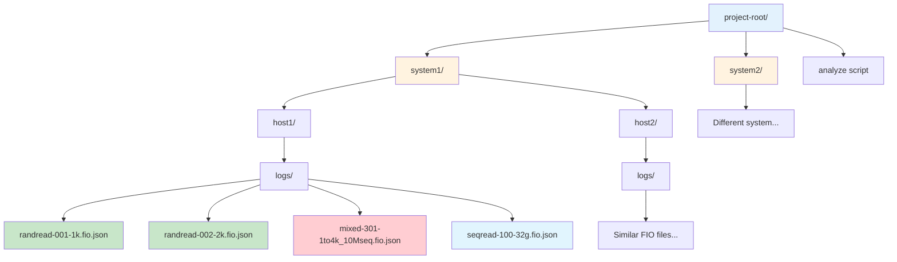

# Cross-System Analysis User Guide

## Overview

The Cross-System Analysis tool compares performance results from different runs of [perfscripts](https://github.com/jshook/perfscripts). It automatically discovers test results, groups them by system profiles, and generates comprehensive performance reports.

## Quick Start

### Prerequisites

- Java 11 or higher
- Maven 3.6 or higher
- FIO test results in JSON format (*.fio.json files)

### Basic Usage

```bash
# Run analysis with default settings
./analyze

# Specify custom report directory
./analyze --report-dir my-analysis

# Update existing report (required for non-default directories)
./analyze --report-dir existing-report -U

# Show help
./analyze --help
```

## Directory Structure

The tool expects your test results to be organized in directories containing *.fio.json files:



**Text representation:**
```
project-root/
├── system1/
│   ├── host1/
│   │   └── logs/
│   │       ├── randread-001-1k.fio.json
│   │       ├── randread-002-2k.fio.json
│   │       └── mixed-301-1to4k_10Mseq.fio.json
│   └── host2/
│       └── logs/
│           └── ...
├── system2/
│   └── ...
└── analyze (executable script)
```

## Analysis Stages

### Stage 1: System Discovery
- Automatically discovers directories containing *.fio.json files
- Groups systems by common path prefixes into "system profiles"
- Creates system names by removing common path components
- 🚫 **Respects `.noscan` files to exclude directories from analysis**

### Stage 2: Individual System Analysis
- Analyzes each system separately
- Determines optimal blocksize from random read tests
- Finds matching mixed workload series based on closest average blocksize
- Performs knee-point analysis to identify performance thresholds
- **Extracts ALL component metrics from optimal mixed workload** (randread, seqread, seqwrite)
- Generates Unicode sparklines showing latency progression across streaming limits

### Stage 3: System Profile Summaries
- Aggregates results within each system profile
- Provides comparative analysis among systems in the same profile

### Stage 4: Cross-Profile Comparisons
- Compares performance across different system profiles
- 🎯 **Uses customizable scoring functions for intelligent rankings**
- Ranks systems and profiles by key performance indicators
- Provides both scored rankings and traditional throughput-based rankings

## Report Structure

The tool generates reports in a `report/` directory (or custom directory):

```
report/
├── manifest.md                      # Human-readable system discovery results
├── manifest.json                    # Machine-readable manifest
├── systemprofile__systemname.md     # Individual system reports
├── systemprofile__systemname.json   # 📊 **System performance metrics (JSON)**
├── PROFILE_systemprofile.md         # System profile summaries  
├── PROFILE_systemprofile.json       # 📊 **Profile performance metrics (JSON)**
└── CROSS_PROFILE_COMPARISON.md      # Cross-profile comparisons with scoring
```

## Workload Types

The tool recognizes these FIO workload patterns:

### Random Read Workloads
- **Pattern**: `randread-###-<blocksize>.fio.json`
- **Example**: `randread-005-16k.fio.json` (random read, 16KB blocks)
- **Key Metrics**: Throughput, IOPS, latency

### Sequential Read/Write Workloads
- **Pattern**: `seqread-###-<filesize>.fio.json` or `seqwrite-###-<filesize>.fio.json`
- **Example**: `seqwrite-200-32g.fio.json` (sequential write, 32GB file)
- **Key Metrics**: Throughput

### Mixed Workloads (Primary Metric Source)
- **Pattern**: `mixed-###-<blockrange>_<limit>.fio.json`
- **Example**: `mixed-301-1to4k_10Mseq.fio.json` (mixed I/O, 1-4KB blocks, 10MB/s sequential limit)
- **Key Metrics**: **ALL component metrics from optimal mixed workload are used as canonical system performance**
  - **Random Read Component**: throughput, IOPS, latency (mean, P50, P95, P99, P99/P50 ratio)
  - **Sequential Read Component**: throughput
  - **Sequential Write Component**: throughput
- **Note**: These component metrics replace separate randread workload metrics as the authoritative performance data

## Command Line Options

| Option | Description |
|--------|-------------|
| `--report-dir DIR` | Specify custom report directory name |
| `--ranking-functions NAME` | 🎯 **Name(s) of ranking function(s) from ranking-functions.json (comma-separated or multiple flags)** |
| `-U` | Update mode - allow overwriting existing reports |
| `-h, --help` | Show help message |

## Advanced Usage

### Custom Report Directory
```bash
# Create report in custom directory
./analyze --report-dir performance-analysis-2024-01

# Update existing custom report
./analyze --report-dir performance-analysis-2024-01 -U
```

### Automation and CI/CD
The tool is designed for automation:
- Exit code 0 on success, non-zero on failure
- JSON manifest for machine processing
- Consistent report structure for parsing
- 📊 **JSON metrics files for programmatic analysis and value functions**

## 🎯 Advanced Ranking Configuration

### Predefined Ranking Functions
The tool includes multiple predefined ranking functions optimized for different use cases:

```bash
# Use specific ranking function
./analyze --ranking-function throughput-focused
```

### Available Ranking Functions

**All metrics are extracted from optimal mixed workload components**

| Function Name | Description | Best For |
|---------------|-------------|----------|
| **`realtime`** | Ultra-low latency: 60% P99 latency, 40% throughput | Real-time systems, interactive applications |
| **`throughput-oriented`** | High-performance: 80% throughput, 15% IOPS, 5% latency | HPC, batch processing, data pipelines |
| **`balanced`** | Even performance: 33.3% throughput, 33.3% latency, 33.3% consistency | General purpose workloads |
| **`consistency-oriented`** | Predictable: 40% consistency, 35% P95 latency, 25% throughput | Mission-critical systems |
| **`ranking-function-example`** | Comprehensive: Uses all available component metrics for illustration | Analysis and comparison |

### Example Usage

```bash
# All ranking functions (default behavior)
./analyze

# High-performance computing workloads
./analyze --ranking-functions throughput-oriented

# Real-time applications  
./analyze --ranking-functions realtime

# Mission-critical systems requiring consistency
./analyze --ranking-functions consistency-oriented

# Multiple ranking functions for comparison
./analyze --ranking-functions realtime,throughput-oriented,balanced

# Multiple ranking functions using multiple flags
./analyze --ranking-functions realtime --ranking-functions balanced
```

### Understanding the ranking-functions.json File

The tool loads ranking functions from `ranking-functions.json` in the current directory. Each function defines:

```json
{
  "function-name": {
    "description": "Human-readable description (metrics from optimal mixed workload components)",
    "components": [
      {
        "metric_name": "randread_throughput_mbps",
        "weight": 0.6,
        "mapping_function": "log",
        "normalization": "minmax",
        "threshold_value": 1000.0,
        "threshold_penalty": 0.5,
        "invert_better": false
      }
    ]
  }
}

### Scoring Configuration Options

**Available Component Metrics from Optimal Mixed Workload:**

**Random Read Component:**
- `randread_throughput_mbps` - Random read throughput (MB/s)
- `randread_iops` - Random read I/O operations per second
- `randread_latency_mean_us` - Mean random read latency (microseconds)
- `randread_latency_p50_us` - 50th percentile random read latency
- `randread_latency_p95_us` - 95th percentile random read latency
- `randread_latency_p99_us` - 99th percentile random read latency
- `randread_latency_p99_p50_ratio` - Tail latency behavior (P99/P50 ratio)

**Sequential Components:**
- `seqread_throughput_mbps` - Sequential read throughput (MB/s)
- `seqwrite_throughput_mbps` - Sequential write throughput (MB/s)

**Analysis Metrics:**
- `knee_point_latency_increase_percent` - Performance degradation at knee point (consistency metric)
- `optimal_stream_limit_mbps` - Stream throttling limit of optimal mixed workload
- `total_workloads` - Number of workload files analyzed (informational)

**Mapping Functions:**
- `linear` - Direct value mapping
- `log` - Logarithmic mapping (good for throughput)
- `inverse` - Inverse mapping (good for latency)
- `threshold` - Binary threshold mapping

**Normalization:**
- `minmax` - Scale to [0,1] range
- `zscore` - Z-score normalization  
- `none` - No normalization

**Threshold Penalties:**
- Set `threshold_value` for "no-go" conditions
- Use `threshold_penalty` (0-1) for massive score reduction
- `invert_better`: true for "lower is better" metrics

### Excluding Directories from Analysis

To exclude specific directories from analysis, create a `.noscan` file:

```bash
# Exclude a problematic or incomplete test directory
touch test-data/broken-system/.noscan

# Exclude temporary or work-in-progress directories  
touch work-in-progress/.noscan
```

Directories containing `.noscan` files (and their subdirectories) will be completely skipped during analysis.

## Troubleshooting

### No Systems Found
- Ensure *.fio.json files exist in subdirectories
- Check file permissions and accessibility
- Verify directory structure matches expected pattern
- Check if directories have been excluded with `.noscan` files

### Compilation Errors
- Verify Java 11+ and Maven 3.6+ are installed
- Check network connectivity for Maven dependencies
- Run `mvn clean compile` manually to diagnose issues

### Analysis Failures
- Check individual system reports for error messages
- Verify FIO JSON files are valid and complete
- Ensure sufficient disk space for report generation

## Tips for Best Results

1. **Consistent Naming**: Use consistent naming patterns for workload files
2. **Complete Test Suites**: Include full range of blocksizes and mixed workloads
3. **Proper Grouping**: Organize systems logically by common characteristics
4. **Regular Analysis**: Run analysis after each test campaign to track performance trends